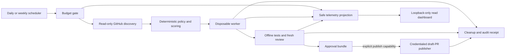

# Leftovers

Leftovers turns a deliberately allocated remainder of daily or weekly agent quota into careful,
small contributions to public open-source projects. It discovers maintainer-requested work, ranks it
with an explainable policy, gives one issue to an agent in a disposable workspace, verifies the
patch, and can publish a disclosed **draft** pull request through a separate credentialed process.

This is intentionally not a PR-volume bot. Extra quota should buy deeper reproduction, testing, and
review—not more unsolicited pull requests.

## What exists

- A dependency-free Python 3.11+ control plane and CLI.
- Curated repository allowlists and strict TOML validation.
- Read-only GitHub discovery pinned to REST API version `2026-03-10`.
- Deterministic eligibility gates and explainable issue scoring.
- Manual/fixed quota envelopes with reserves, P95 safety margins, and transactional per-window
  reservations so repeated invocations cannot spend the same local envelope; stale snapshots and
  runs too close to reset are rejected.
- Planning and implementation prompt contracts, fresh independent review, and deterministic
  controller-rendered draft-PR text from verified evidence.
- Docker/Podman rehearsal command construction with no GitHub credential in the worker; the stock
  runner cannot attest production isolation and is rejected before quota or discovery.
- Offline operator-curated verification commands plus structural rename/file-mode, dependency,
  license, secret, size, and forbidden-path gates.
- A hash-chained redacted audit journal plus label-checked container cleanup that must complete before
  marker-checked workspace deletion.
- Qualified model check-ins and token receipts projected into a separate, non-authoritative SQLite
  telemetry store; synthetic training usage is isolated from production totals.
- A dependency-free, read-only operations dashboard that binds only to literal loopback and shows
  maximum/remaining/reserved/known-used token semantics, run stages, and model freshness.
- A deterministic no-network training cycle that exercises planning, implementation, offline tests,
  review, approval, telemetry, and proven cleanup without a GitHub remote or credential.
- A separate, draft-only `gh` publisher with three explicit authorization gates, local output caps,
  repository cooldowns, early publish-eligibility preflight, and fail-closed partial-publication
  handling.
- Daily/weekly scheduler templates and a container-first CI/test path.
- A portable macOS **scout-only** bundle: it performs read-only repository nomination and a
  synthetic Seatbelt rehearsal, but has no reachable host/OCI contribution-execution path.
- A compile-checked Virtualization.framework launcher proof with a fixed Linux hardware graph,
  manifest-v2 separation between immutable boot artifacts and sealed per-run inputs, a preallocated
  scratch disk, and zero NIC, socket, or host directory-share devices. It remains fail-closed until
  a reviewed guest and result handoff exist.

## System boundary



Issue text, comments, repository files, build scripts, model output, and logs are untrusted. The
worker cannot publish. Only deterministic publisher code receives GitHub write credentials, after
the patch and policy hashes are frozen.

## Honest quota limitation

There is no universal supported API for “unused tokens” in consumer AI subscriptions. A rolling
message/rate window is not necessarily a transferable token balance, and separately billed APIs do
not automatically consume subscription allowance. Leftovers therefore ships only with:

- `fixed`: a quota envelope intentionally allocated to a scheduled run;
- `environment`: a manual or official-adapter snapshot supplied through an environment variable;
- `--remaining-tokens`: a one-run manual snapshot.

Unknown quota fails closed. UI scraping is deliberately excluded. See
[`docs/BUDGET_ADAPTERS.md`](docs/BUDGET_ADAPTERS.md).

The reservation ledger is admission control, not a provider-enforced token ceiling. It cannot meter
or terminate a provider request, and its P95 estimate may be wrong; retain a real provider-side limit
or broker cutoff when the provider supports one.

## Quick start

### macOS: one bounded preview for tonight

From this repository on a signed-in macOS user account, run:

```sh
./scripts/install-macos.sh --force-config --scout
```

This creates a private bundle under `.leftovers/install`, validates its deliberately safe
configuration, runs a synthetic Seatbelt rehearsal, performs one read-only repository scan, and
exits. It does not depend on this chat or on the Codex desktop app process. It needs a saved Codex CLI
login, a Terra-capable Codex CLI (`0.144.5+`), Python 3.11+, Git, `sandbox-exec`, and an authenticated
`gh` CLI for read-only GitHub scouting. It never asks for or writes a GitHub token; it obtains the
existing `gh auth token` in memory only for the read request.

This is **not** a contribution-execution or publishing installation. Its configuration contains a
non-executable placeholder repository, external writes are disabled, the scout receives no
Codex credential path, and a build-time gate stops after read-only scouting. Docker/Podman and the
host adapter are rehearsal-only even if installed. The candidate report is
`.leftovers/install/reports/repository-candidates.json`; manual curation does not bypass the VM
gate. See
[`docs/MACOS_PACKAGE.md`](docs/MACOS_PACKAGE.md) for its exact prerequisites, limits, cleanup, and
strict-VM status.

The foreground `--scout` command is the safe choice for checkouts under macOS-protected Desktop,
Documents, or Downloads folders. `--launch-now` is available only from a checkout outside those
folders; the installer fails before mutation instead of asking for Full Disk Access. Check the
result with `./scripts/status-macos.sh`; remove the manifest-bound package with
`./scripts/uninstall-macos.sh`. Build a reproducible transfer archive with `make macos-package`.

1. Copy and curate the example configuration:

   ```sh
   cp config/leftovers.example.toml config/leftovers.toml
   ```

2. Replace the example repository, confirm its contribution and AI policies, and enter only
   commands you have reviewed. Keep publication in `dry-run` mode.

3. Build and test through a container runtime:

   ```sh
   make test
   make package-smoke
   make training-run
   ```

   `package-smoke` builds the wheel, installs it into a clean image, and verifies the installed
   `leftovers` command plus all prompt and dashboard package data with networking disabled.

4. Validate and inspect the local demo without network access:

   ```sh
   PYTHONPATH=src python3 -m leftovers --config config/leftovers.toml validate
   PYTHONPATH=src python3 -m leftovers --config config/leftovers.toml \
     scout --fixture examples/issues.json
   ```

5. Run a read-only live scout. `GITHUB_TOKEN` here should be read-only:

   ```sh
   PYTHONPATH=src python3 -m leftovers --config config/leftovers.toml doctor
   PYTHONPATH=src python3 -m leftovers --config config/leftovers.toml scout
   ```

6. Confirm production execution fails closed before discovery:

   ```sh
   PYTHONPATH=src python3 -m leftovers --config config/leftovers.toml run --execute
   ```

The stock sandbox image does not embed a model provider or credentials. At present the command above
returns `policy_denied` before either an agent command or container runtime is invoked:
the stock `AgentRunner`, every host backend, bridge networking, and ambient environment forwarding
are all forbidden for production. The bundled `scripts/codex_adapter.py` pins
`gpt-5.6-terra` / `high`, but is retained only for bounded adapter tests and cannot be launched by
the detached job. See
[`docs/AGENT_ADAPTERS.md`](docs/AGENT_ADAPTERS.md) for the exact stdin/result-file contract and
credential tradeoffs.

## Prove the control plane before using it

The rehearsal is a real contribution lifecycle over a controller-owned local Git fixture. It has no
remote, never invokes the publisher, reports synthetic usage, and leaves its audit/telemetry evidence
under a unique owner-only root in `<state_dir>/rehearsals/`. `run_kind="training"` is not a public
escape hatch: it accepts only the attested rehearsal runner/source/lease triple with the fixed
deterministic identity, no network or environment forwarding, and dry-run publication.

For the deterministic OCI rehearsal:

```sh
make rehearsal-image
PYTHONPATH=src python3 -m leftovers --config config/leftovers.example.toml \
  training-run --mode docker --image leftovers-rehearsal:local \
  --profile auto --report .leftovers/rehearsal-report.json
```

Use `--mode podman` with a Podman-built image when appropriate. `make training-run` uses `RUNTIME`
and performs both builds. A successful JSON result has `execution_profile: "oci-container"`, every
check is true, the managed workspace is absent, and no exactly labeled run container remains.

When no container runtime is available, this is diagnostic only:

```sh
make training-run-process
```

On macOS, `--profile auto` uses `sandbox-exec` when available and labels the result
`macos-seatbelt-supplemental`. Elsewhere it reports `unsandboxed-process-supplemental`. Neither
process result is an OCI isolation claim, even when the functional lifecycle passes.

## Local operations dashboard

After a run has created `<state_dir>/telemetry.sqlite3`, start the read-only dashboard:

```sh
PYTHONPATH=src python3 -m leftovers --config config/leftovers.toml \
  dashboard --host 127.0.0.1 --port 8765 --workers 4
```

Open `http://127.0.0.1:8765/`. The server refuses wildcard/LAN binds, writes, permissive CORS, and
unexpected Host/Origin values. It is intentionally not hosted publicly: operational quota and model
activity are private metadata, and the dashboard has no authentication layer. For remote access, use
an authenticated SSH loopback forward. Telemetry is observability only; it cannot admit work,
release reservations, or authorize publication. See [`docs/TELEMETRY.md`](docs/TELEMETRY.md).

## Enabling draft PRs

This section documents the publication contract for a future admitted strict runner. In the current
release, neither publication configuration nor `--publish` can bypass the earlier production
isolation gate; host and stock OCI paths remain unable to reach the publisher.

Publication needs all three gates:

1. `publication.mode = "draft-pr"`;
2. `publication.external_writes_acknowledged = true`;
3. `leftovers run --execute --publish` for that run (or an explicitly configured scheduled wrapper).

Draft mode also requires `publication.expected_login` and immutable
`publication.expected_user_id`. The publisher resolves `gh api user` and refuses to write unless both
values match, preventing an accidental account switch from inheriting authorization.

The publisher uses the authenticated `gh` identity, creates/reuses its personal fork, pushes a
deterministic issue branch, and opens a draft PR. The local workspace is removed; the remote branch
stays because the open PR needs it. Managed containers are removed and their absence is proven before
the bound workspace is deleted. Leftovers never auto-merges or marks a PR ready.

Each invocation selects and attempts at most one issue. Budget reservations are recorded in
`<state_dir>/budget.sqlite3`; draft-publication slots and repository cooldowns are recorded in
`<state_dir>/publications.sqlite3`. A failed publication is not retried automatically: it remains a
conservative `publish_partial` requiring operator reconciliation of the fork, branch, PR, journal,
and local ledger before another write attempt.

For arbitrary public cross-organization contributions, GitHub Apps and fine-grained PATs have
topology limitations. Use a clearly identified dedicated contributor account with no private-repo
access, keep its credential controller-only, and cap output to one active PR per repository. See
[`docs/GITHUB_INTEGRATION.md`](docs/GITHUB_INTEGRATION.md).

## Safety profiles

- **OCI rehearsal profile:** Docker/Podman with the hardening flags in `runner.py`. It proves
  deterministic control-plane behavior but is not admitted for unattended repository execution.
- **Strict-VM proof:** [`vm/README.md`](vm/README.md) documents a per-run, zero-NIC
  Virtualization.framework launcher. The launcher, sealed request/result format, cleanup lease,
  one-epoch controller, rejection-only guest source, Codex output parser, and dedicated-broker
  protocol model have deterministic tests. The guest has not been built or booted, provider and
  broker services do not exist, broker attestations cannot be issued, and every execution gate is
  hard-disabled; production therefore remains disabled.
- **Host-agent profile:** the bundled Codex adapter runs `gpt-5.6-terra` at `high` reasoning through
  the saved CLI login, with ephemeral sessions, no inherited shell environment, no agent network,
  structured outputs, and hard per-stage time limits. It is test/rehearsal-only, is rejected before
  production discovery, and cannot publish.

Do not autonomously run intentionally hostile repositories with either the host or OCI rehearsal
profile. Review the remaining gaps in [`SECURITY.md`](SECURITY.md); configuration changes alone
cannot enable production writes.

## Repository map

- [`AGENTS.md`](AGENTS.md): concrete operating instructions for agents and maintainers.
- [`ARCHITECTURE.md`](ARCHITECTURE.md): trust zones, lifecycle, scoring, and failure semantics.
- [`PROTOCOL.md`](PROTOCOL.md): prompt/result contracts and state invariants.
- [`SECURITY.md`](SECURITY.md): threat model, hard gates, and assurance limits.
- [`docs/AGENT_ADAPTERS.md`](docs/AGENT_ADAPTERS.md): provider adapter contract and v0.1 limits.
- [`docs/MACOS_PACKAGE.md`](docs/MACOS_PACKAGE.md): portable macOS preview installation, detached
  job, curation, verification, and footprint.
- [`vm/README.md`](vm/README.md): strict macOS VM device contract, launcher receipt, and remaining
  guest/broker blockers.
- [`docs/CODEX_CLI_MEDIATOR.md`](docs/CODEX_CLI_MEDIATOR.md): hard-disabled Terra/high inference,
  usage-evidence, and token-ledger boundary.
- [`docs/STRICT_VM_BROKER.md`](docs/STRICT_VM_BROKER.md): dedicated-UID broker protocol model and
  activation blockers.
- [`docs/OPERATIONS.md`](docs/OPERATIONS.md): activation, scheduler installation, and recovery.
- [`docs/TELEMETRY.md`](docs/TELEMETRY.md): exact quota/check-in semantics, dashboard boundary, and
  rehearsal evidence.
- [`config/leftovers.example.toml`](config/leftovers.example.toml): complete safe-default config.
- [`src/leftovers`](src/leftovers): control plane, GitHub client, runner, policy, and publisher.
- [`schedules`](schedules): daily/weekly launchd and systemd examples.
- [`tests`](tests): deterministic safety, policy, prompt, telemetry, dashboard, rehearsal, cleanup,
  and integrity tests.

## Project state and license

This is an initial operational scaffold. It defaults to dry-run, requires deliberate repository
curation, and currently denies production issue execution until the strict VM path is integrated.
Licensed under Apache-2.0; see [`LICENSE`](LICENSE).
